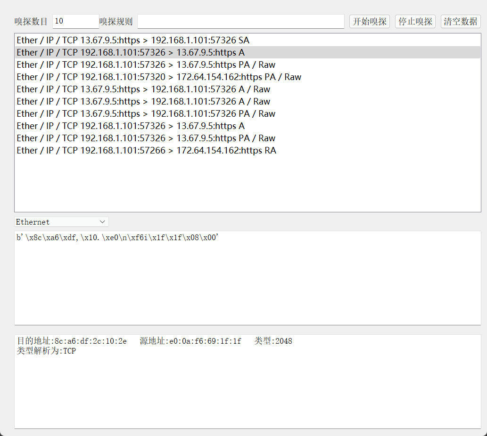
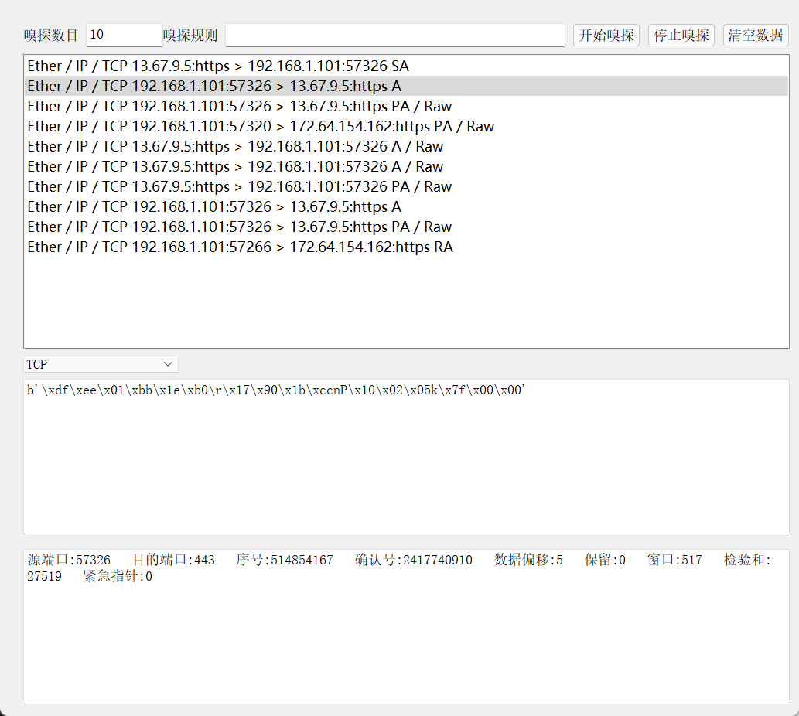
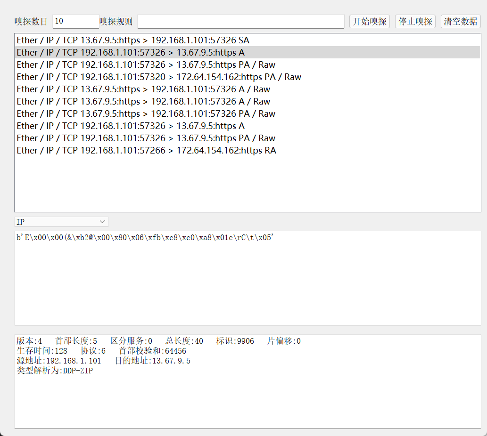
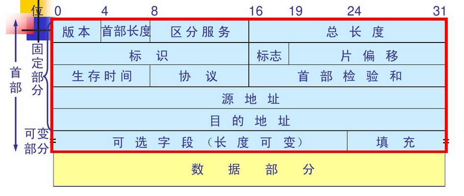
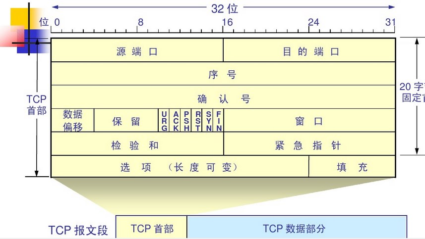
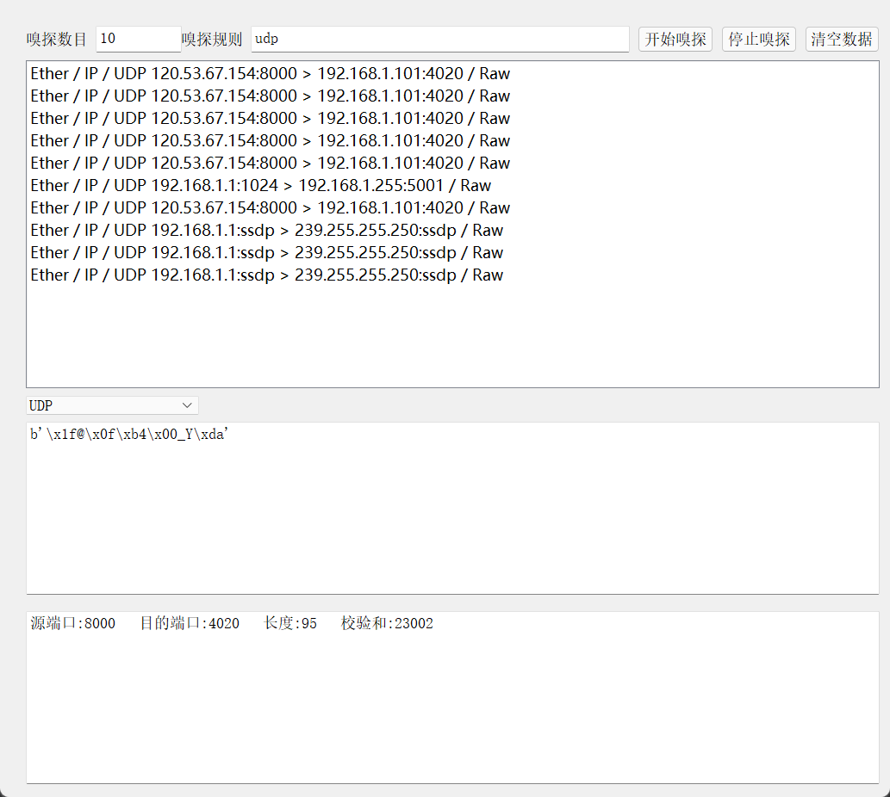
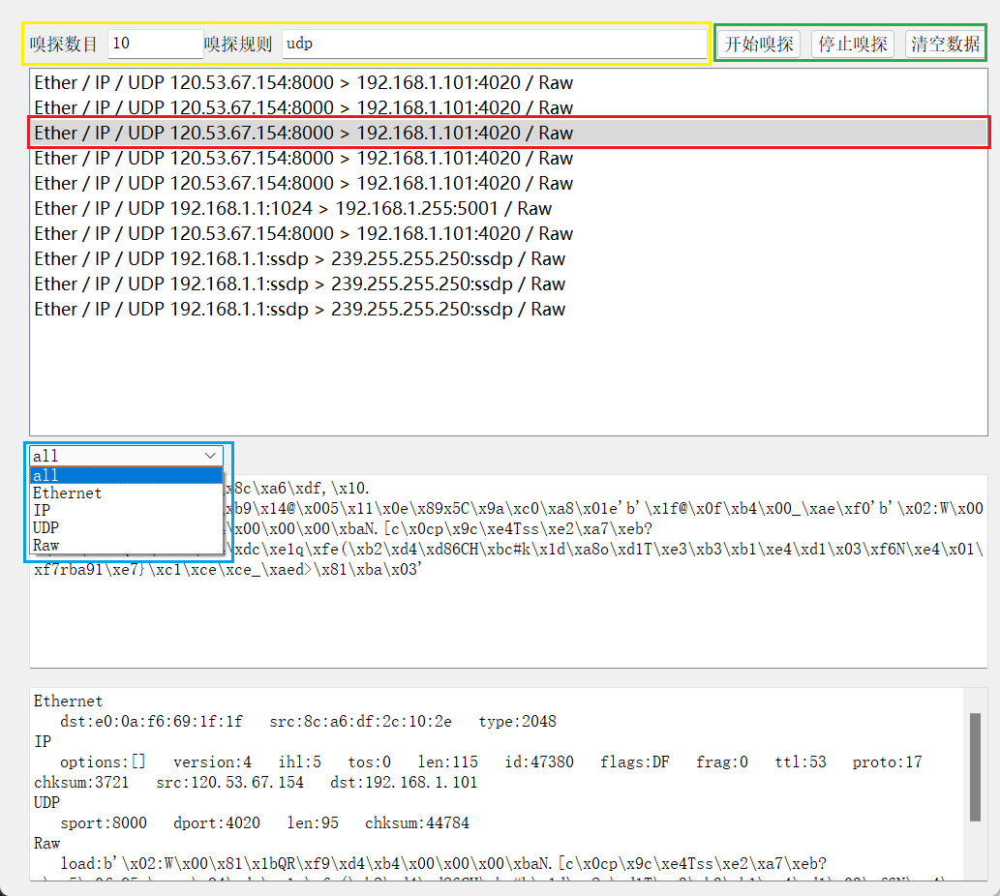

# 嗅探器设计

代码链接：https://github.com/small-han/sniffer

老师可以直接阅读markdown版本
## 实验环境
此次实验采用的编程语言是python3.8，嗅探程序采用的是scapy2.4.1，可视化程序采用的是pyqt5.12搭配qt designer。
## 实验流程
### 包的获取
包的获取在scapy里的实现比较简单，利用scapy带有的sniffer( filter="" , iface="any", prn=function, count=N)函数即可以实现。

filter负责执行包的过滤，iface选择相应的网卡进行抓包，在此次实验中，我的iface设置为any，即从所有的网络接口抓包。prn是sniffer的回调函数，每当接受到一个包的时候就会调用次函数，count是一次嗅探的包数，当嗅探到count，结束嗅探。（设置为0表示无限嗅探）

我这里为了多线程的正常运行，使用的是异步的AsyncSniffer，参数同上。
### 包的过滤
包的过滤是采用了sniffer中的filter参数，这里的参数采用的是Berkeley Packet Filter (BPF)语法。BPF语法有三种限定词：
+ 类型

host net port
+ 传输方向

src dst
+ 协议

ether ip tcp udp http ftp

第一种限定词后面需要加字符，比如port 80表示含有80端口的包;host 192.168.1.1表示。二三种限定词不需要加字符。这三种限定词可以组合在一起，比如tcp dst host 1.2.3.4，就表示发送到1.2.3.4主机的tcp包。

利用这强大的bpf语法，实验的过滤实现起来就方便了许多。
### 包的解析
scapy的自带解析范围很广，在scapy之外，我针对于常见的tcp，ip，udp，ethernet包进行额外的分析。比如下图我针对ethernet的包进行了分析。

图片的主体有三块文字区域，第一块是已嗅探的包，第二块是包的原版本，第三块是包的解析版本ethernet的首部见下图所示
在解析了目的地址和源地址之外，我还对类型进行了分析，可以看到分析的结果下一层为TCP层

那么我再对tcp和ip进行解析，见下图
在ip的解析中，我们 可以看到协议为6，通过解析知道6号端口是ddpzip区块信息协议。另外再附上tcp，ip的报头格式

最后还有一个udp的解析。
我利用嗅探规则筛选了udp的包，结果如下图所示

### 界面设计
界面的设计我以下图举例
黄色区域负责嗅探数目和规则的设置，绿色区域是控制按钮。当点击“开始嗅探”后会在第一个文本框显示出包的简要信息。如果想进一步查看某一个包，像红色区域一样点击即可。点击之后会在蓝色区域显示出这个包所有的层，可以选择某一个层进行显示，也可以显示所有的层。